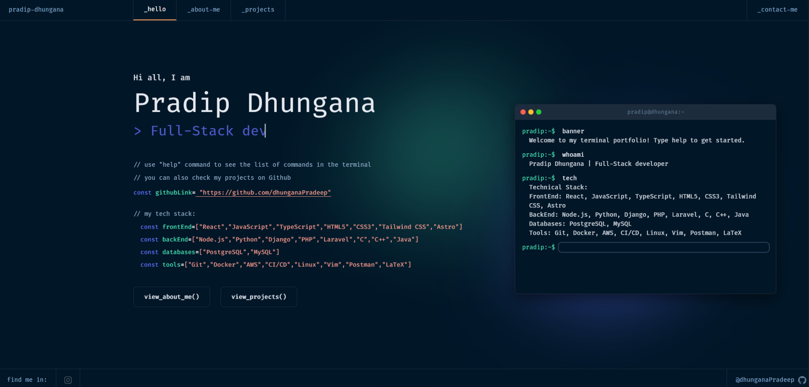

<h1 align="center">
  Pradip Dhungana's Portfolio
</h1>

<p align="center">
  My personal portfolio website, showcasing my skills, projects, and contact information in a unique and interactive way. Built with <a href="https://nuxt.com/" target="_blank">Nuxt.js 3.0</a>, this portfolio includes a custom terminal interface on the home page for an engaging user experience.
</p>

<div align="center">

[](https://app.netlify.com/sites/developer-portfolio-v2/deploys)

</div>

<p align="center">
  <a href="" target="_blank">
    
  </a>
</p>

## ✨ Features

- **Interactive Terminal Interface**: A fully functional terminal on the home page where users can type commands like `whoami`, `tech`, `projects`, and `contact` to explore my portfolio dynamically.
- **Customizable Content**: Easily update project details, skills, and contact information via a single `developer.json` file.
- **Responsive Design**: Optimized for both desktop and mobile devices, ensuring a seamless experience across platforms.
- **PWA Support**: Configurable as a Progressive Web App for offline access and enhanced performance.

## 🚀 Getting Started

### Installation

1. Clone the repository to your local machine:

```sh
git clone https://github.com/dhunganaPradeep/portfolio.git
```

2. Navigate to the project directory:

```sh
cd portfolio
```

3. Install the required dependencies:

```sh
yarn
```

4. Start the development server:

```sh
yarn dev
```

5. Open your browser and visit <a href="http://localhost:3000/">http://localhost:3000/</a>.

## ✒️ Customization

To personalize the portfolio:

- **Update Content**: Modify the `developer.json` file to update your personal information, projects, skills, and contact details.
- **Meta Tags**: Edit `nuxt.config.ts` to customize SEO and website metadata.
- **PWA Settings**: Configure the Progressive Web App in `public/pwa/manifest.json`.
- **Styling**: Adjust the CSS in components and pages to match your personal brand.

### Terminal Interface
The home page features a custom terminal built with Vue.js, allowing users to interact with commands like:

- `help`: List available commands.
- `whoami`: Display your name and role.
- `tech`: Show your technical skills.
- `projects`: List your recent projects.
- `contact`: Share your contact information.
- `goto [section]`: Navigate to sections like `about-me`, `projects`, or `contact`.

The terminal supports command history, tab completion, and smooth scrolling for an immersive experience.

## 🛠 Building for Production

1. Generate a static production build:

```sh
yarn build
```

2. Preview the production site:

```sh
yarn preview
```


## 🙏 Credits

This portfolio was heavily modified and customized by me, but it was inspired by the open-source <a href="https://github.com/alexdeploy/developer-portfolio-v2">developer-portfolio-v2</a>, designed by <a href="https://www.behance.net/darelova" target="_blank">@darelova</a> and developed by <a href="https://github.com/alexdeploy">@alexdeploy</a>. Their original concept provided a solid foundation, and I’m grateful for their work. Please give them credit if you use their original repository.

Thanks for visiting my portfolio! 🚀

